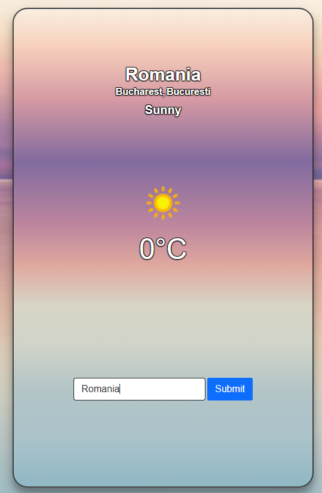

<h1 align="center">Simple Weather App</h1>

<p align="center">
  
</p>

<p align="center">
  <a href="https://iuliangabriel.github.io/Weather-App/" style="display:inline-block;">Live App</a>
</p>

## Overview

This project is a web-based Weather App that allows users to check the current weather conditions for a specific location. It provides real-time weather information using a third-party weather API.

## Features

- **Current Weather**: View the current temperature, weather description, and other relevant details.
- **Location Search**: Search for the weather in different locations around the world.
- **Responsive Design**: Works seamlessly on various devices and screen sizes.
- **Weather Icons**: Visual representation of weather conditions for better user experience.

## Technologies Used

- HTML5
- CSS3
- JavaScript
- [Weather API](https://www.weatherapi.com/)

## Installation

1. Clone the repository:

   ```bash
   git clone https://github.com/IulianGabriel/Weather-App
